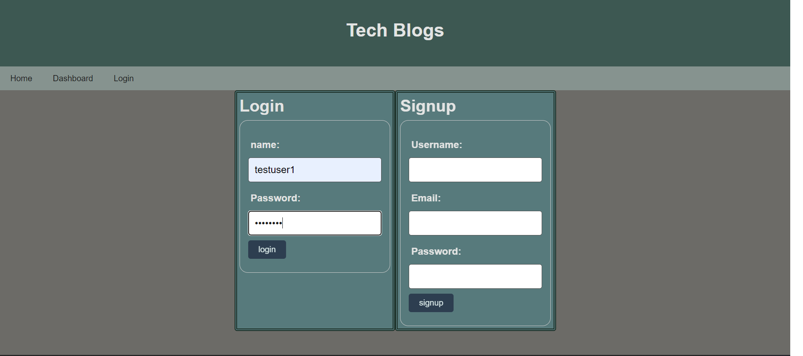
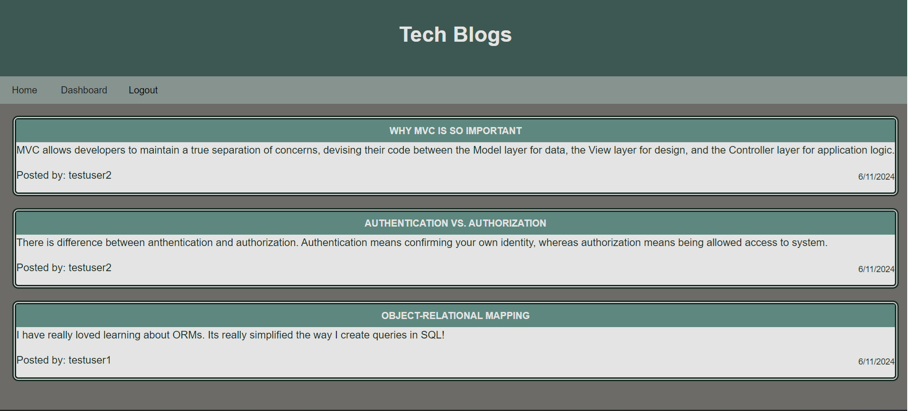
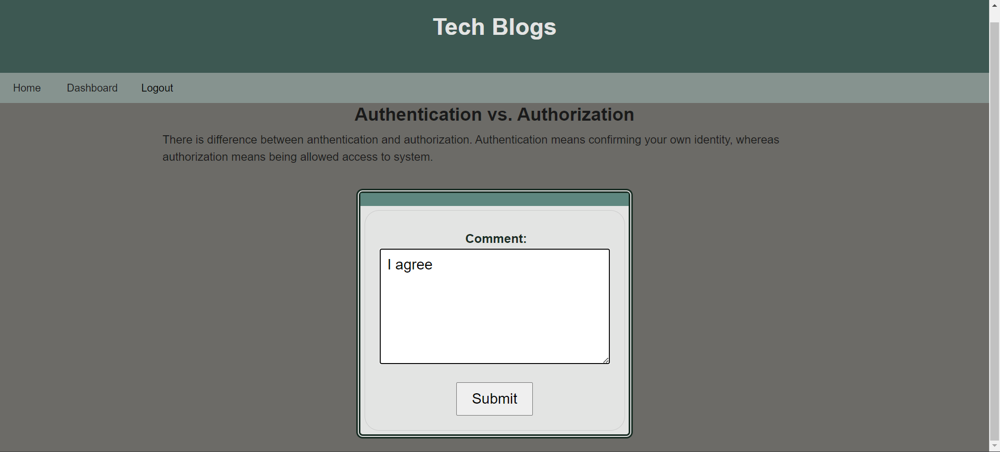
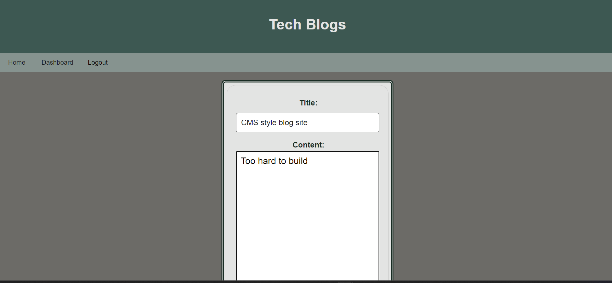
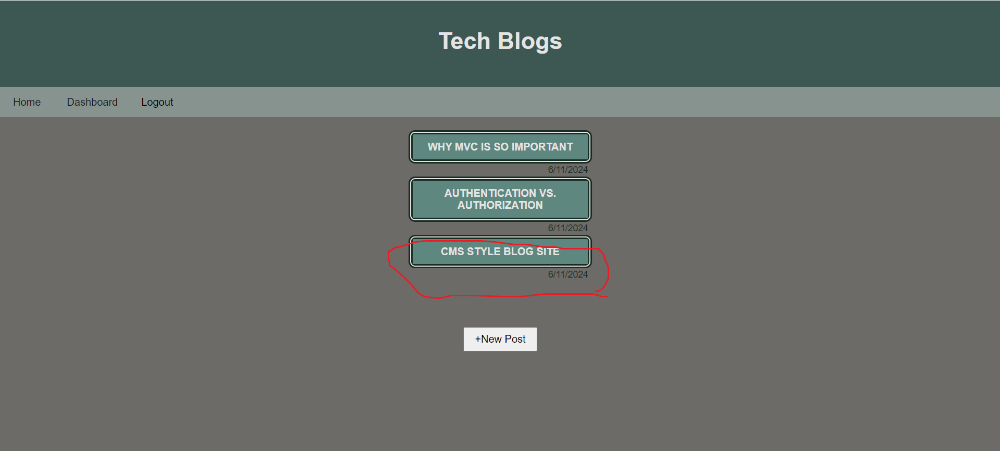
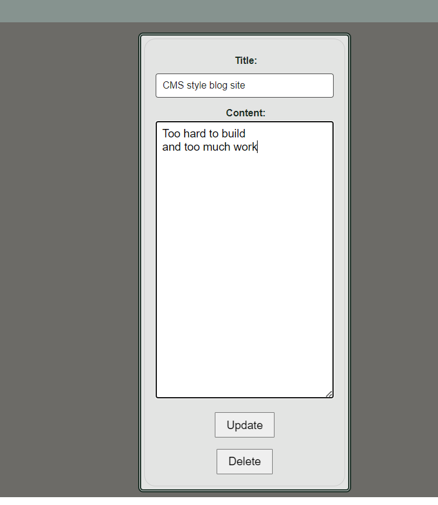

# CMS Style Blog Site

## Description

- This site can view blogs and comment.
- allow user to login logout sign up to comment or add blog
- add and update blog, add comment and delete blog post

## How to run

1. open the terminal and run npm install to install all necessary 
2. run psql -U postgres to start postgre SQL database (then type test as password)
3. \i db/schema.sql to create database
4. run npm run seed to seed data to the database
5. npm start
6. test users data for login is in in seeds/userData.js
7. currently session time out is set to 1 hour

## Usage

- Git repository URL: https://github.com/namahage1/CMS-style-blog-site.git
- Render URL: https://cms-style-blog-site.onrender.com
    
 
 
 
 
 
 
    

